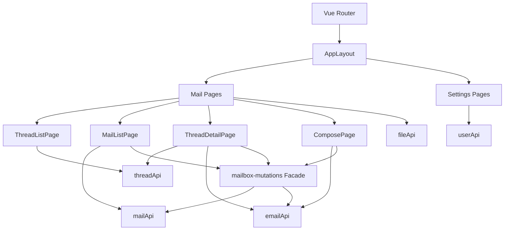
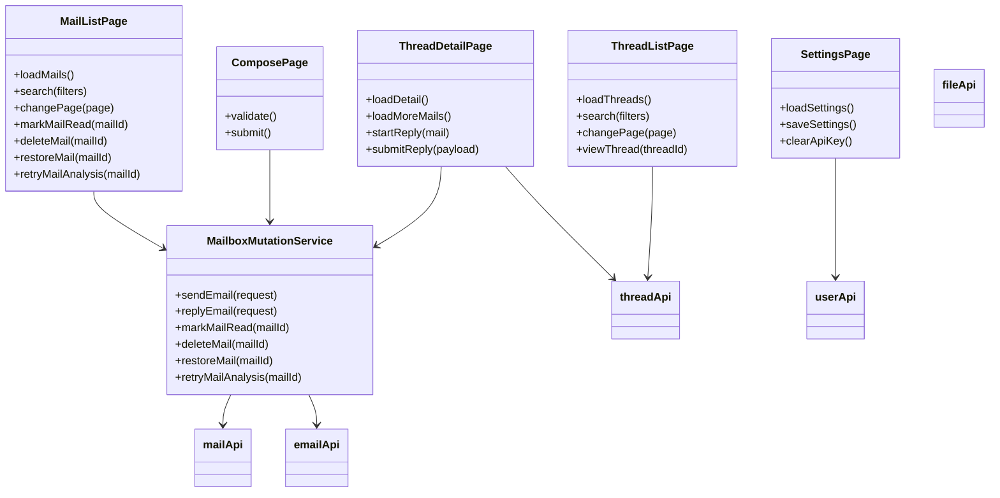
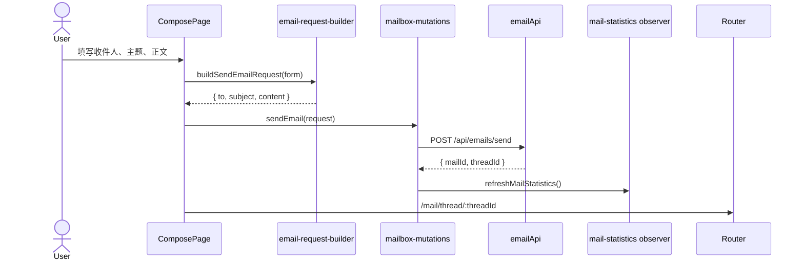
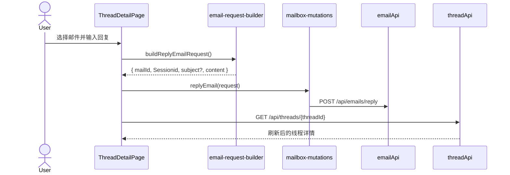
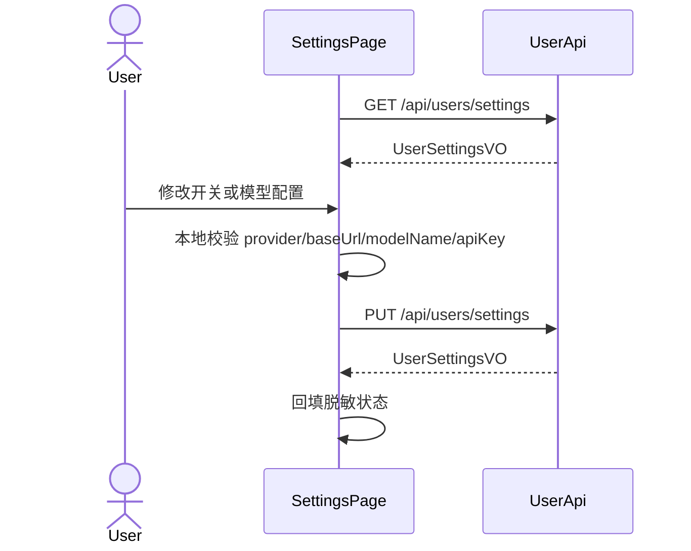
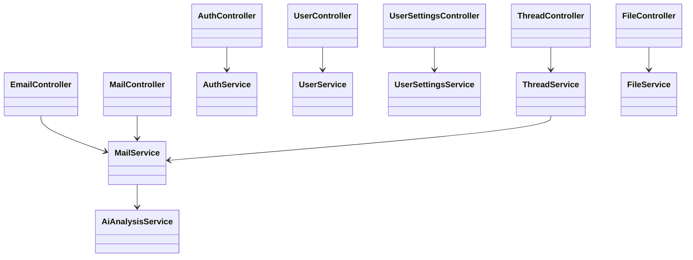

# 站内邮件系统完工开发总规划

状态日期：2026-07-05  
适用范围：从当前前端重构状态出发，规划到项目整体可交付完工。  
接口基准：`docs/接口/最终默认模块.openapi.json`。

## 1. 当前状态结论

### 1.1 已确认事实

- 当前仓库只有前端工程 `frontend`、接口文档和设计文档；没有后端工程目录。
- 当前前端技术栈为 Vue 3、Vue Router、Pinia、Element Plus、Tailwind CSS、Axios、Vitest、Vite。
- 当前最终接口以 `docs/接口/默认模块.openapi.json` 为准
- 线程接口只读：
  - `GET /api/threads`
  - `GET /api/threads/{threadId}`
- 邮件状态变更仍由邮件接口承担：
  - `DELETE /api/mails/{mailId}`
  - `PATCH /api/mails/{mailId}/read`
  - `PATCH /api/mails/{mailId}/restore`
  - `POST /api/mails/{mailId}/analysis/retry`
  - `GET /api/mails/statistics`
- 非废弃发送接口为：
  - `POST /api/emails/send`，请求字段为 `to`、`subject`、`content`
  - `POST /api/emails/reply`，请求字段为 `mailId`、`Sessionid`、`subject?`、`content`
- 废弃接口仍在最终 OpenAPI 中保留：
  - `POST /api/mails`
  - `GET /api/mails/inbox`
  - `GET /api/mails/{mailId}`
- 附件能力有文件接口：
  - `POST /api/files`
  - `GET /api/files/{fileId}/download`
- 但当前非废弃 `/api/emails/send` 没有 `attachmentFileId` 字段；附件发送能力存在契约决策缺口。

### 1.2 当前已完成的前端主线

- 认证页有登录、注册表单与基础测试。
- 路由守卫能根据 `mail_token` 控制访问。
- AppLayout 能加载邮件统计并展示侧边栏计数。
- 收件箱使用线程列表 `/mail/inbox`。
- 已发送、已删除、垃圾邮箱使用邮件列表。
- 邮件列表支持筛选、Element Plus 时间范围、分页、邮件级操作。
- 分页已固定在列表页右下角。
- 邮件行点击进入线程详情 `/mail/thread/:threadId`。
- 线程详情支持 cursor 加载更多和回复。
- 发送邮件页面已接入 `/api/emails/send`。
- 回复已接入 `/api/emails/reply`。
- API 适配、页面行为、契约守护已有 Vitest 覆盖。
- 当前验证基线：
  - `npm.cmd test` 通过，22 个测试文件，64 个用例。
  - `npm.cmd run build` 通过。
  - 构建仍有第三方 `@vueuse/core` pure annotation 警告和大 chunk 警告。

### 1.3 当前主要缺口

| 类别          | 当前状态                                      | 完工要求                                                                 |
| ------------- | --------------------------------------------- | ------------------------------------------------------------------------ |
| 设置页        | 目前基本是静态 UI                             | 接入 `GET/PUT /api/users/settings`，支持 AI 开关、模型配置、API Key 规则 |
| 修改密码      | 只提示“接口待接入”                            | 接入 `PUT /api/users/password`，完成校验、提交、错误处理                 |
| 用户信息      | 登录后只用 login 返回的用户基础信息           | 登录后补拉 `/api/users/me`，刷新头像、邮箱、昵称                         |
| 附件/文件     | 有 `fileApi`，页面未用                        | 上传、下载、附件展示、内嵌图片渲染需要专项实现                           |
| 富文本        | 当前 textarea 转段落                          | 需要支持图片节点渲染；编辑能力可先保持 MVP，不上复杂编辑器               |
| AI 分析展示   | 列表有风险/优先级标签，详情未完整展示分析面板 | 线程详情中按邮件展示分析状态、风险原因、优先级等                         |
| 垃圾/风险体验 | 列表可筛选                                    | 需要更完整展示 `riskReason`、`spamLevelLabel`、失败重试反馈              |
| UI 文案       | 多处中文已出现编码损坏                        | 全量修复中文文案，避免交付时乱码                                         |
| 后端          | 当前仓库未包含后端                            | 需要按最终 OpenAPI 实现或接入外部后端，并完成联调                        |
| E2E           | 目前主要是单元/组件测试                       | 需要 Playwright 或同级 E2E 覆盖核心用户流                                |
| 部署          | 当前仅前端 build                              | 需要环境变量、后端地址、部署说明和验收脚本                               |

## 2. 总体完工策略

### 2.1 主攻方向

主攻方向是先完成“无附件的站内邮件闭环”，再做“设置与 AI 配置闭环”，最后处理“附件/文件、后端联调、部署验收”。

原因：

- 邮件/线程主线已经基本建立，继续补齐能最快形成可演示版本。
- 设置页和修改密码是最终接口中的非废弃接口，当前缺口明确，风险可控。
- 附件能力虽然重要，但当前非废弃发送接口没有附件字段，先做会导致契约不稳，需要单独决策。
- 后端工程不在当前仓库，必须把前端可测收口和后端交付计划拆开。

### 2.2 质量方法

后续所有功能继续使用 TDD：

1. 先写失败测试，锁定接口契约或页面行为。
2. 运行目标测试，确认失败原因正确。
3. 写最小实现。
4. 跑目标测试。
5. 跑相关测试。
6. 每个阶段结束跑全量 `npm.cmd test` 和 `npm.cmd run build`。
7. 阶段收口时运行契约扫描，防止回退到废弃接口或旧路由。

### 2.3 不做兼容的边界

以下内容不做兼容：

- 不恢复 `/mail/:mailId` 页面路由。
- 不在前端继续使用线程 mutation。
- 不把收件箱主视图切回邮件列表。
- 不支持旧发送 payload 的 `recipientUsername` 作为非废弃发送接口字段。
- 不为废弃 `GET /api/mails/{mailId}` 重新设计独立详情页，除非附件专项确认必须短期复用。

## 3. 架构与职责拆解

### 3.1 当前前端分层

### 3.2 GoF 责任边界

| 模块                         | 设计角色                 | 责任                                       |
| ---------------------------- | ------------------------ | ------------------------------------------ |
| `email-request-builder.ts`   | Builder / Adapter        | 把页面表单转换成最终接口 payload           |
| `mailbox-mutations.ts`       | Facade                   | 集中处理发送、回复、邮件状态变更和统计刷新 |
| `mail-statistics-context.ts` | Observer channel         | AppLayout 向页面提供统计刷新能力           |
| `mailApi.ts`                 | Gateway                  | 只封装最终邮件接口                         |
| `threadApi.ts`               | Gateway                  | 只封装线程只读接口                         |
| `fileApi.ts`                 | Gateway                  | 封装上传、下载、Blob URL                   |
| `ThreadMessageList.vue`      | Presentational Component | 只展示线程记录和向外抛事件                 |
| `ThreadTimeline.vue`         | Presentational Component | 展示线程内邮件时间线                       |
| `SettingsPage.vue`           | Page Controller          | 管理设置表单、校验、保存状态               |

### 3.3 UML 组件图

### 3.4 关键时序

发送邮件：

线程回复：

设置保存：

## 4. 从当前到完工的开发顺序

### Phase 3：设置页真实接入

目标：让 `/settings` 从静态页面变成真实配置页。

范围：

- 接入 `GET /api/users/settings`。
- 接入 `PUT /api/users/settings`。
- 支持字段：
  - `aiEnabled`
  - `autoReplyEnabled`
  - `prioritySortEnabled`
  - `provider`
  - `baseUrl`
  - `modelName`
  - `apiKey`
  - `timeoutMs`
  - `maxTokens`
  - `temperature`
- 展示：
  - `modelConfigured`
  - `apiKeyConfigured`
  - `maskedApiKey`
- API Key 规则：
  - 不输入 `apiKey` 表示不修改旧 Key。
  - 输入空字符串表示清空 Key。
  - 首次配置模型时必须输入 Key。

建议文件：

- 修改 `frontend/src/pages/settings/SettingsPage.vue`
- 修改或补充 `frontend/tests/settings-page.test.ts`
- 复查 `frontend/src/api/user.ts`
- 复查 `frontend/src/api/type.ts`

TDD 用例：

- 页面加载时调用 `userApi.getSettings()` 并回显。
- 修改开关后提交最小 payload。
- 首次配置模型时缺少 `apiKey` 阻止提交并显示错误。
- 已配置 Key 时不输入 `apiKey`，提交 payload 不包含 `apiKey`。
- 点击“清空 Key”后提交 `apiKey: ""`。
- 保存成功后用响应数据回填页面。

验收：

- `npm.cmd test -- tests/settings-page.test.ts`
- `npm.cmd test`
- `npm.cmd run build`

### Phase 4：修改密码真实接入

目标：让 `/settings/password` 调用真实接口。

范围：

- 接入 `userApi.changePassword()`。
- 表单字段映射：
  - `currentPassword`
  - `newPassword`
- `confirmPassword` 仅前端校验，不传后端。
- 成功后清空表单并提示保存成功。
- 失败时显示接口错误。

建议文件：

- 修改 `frontend/src/pages/settings/ChangePasswordPage.vue`
- 新增或修改 `frontend/tests/change-password-page.test.ts`
- 复查 `frontend/src/api/user.ts`

TDD 用例：

- 当前密码为空不能提交。
- 新密码少于 8 位不能提交。
- 两次新密码不一致不能提交。
- 表单合法时调用 `userApi.changePassword({ currentPassword, newPassword })`。
- 成功后清空输入。

验收：

- `npm.cmd test -- tests/change-password-page.test.ts`
- `npm.cmd test`
- `npm.cmd run build`

### Phase 5：用户会话与当前用户信息收口

目标：登录态、当前用户、侧边栏头像和 401 处理形成稳定闭环。

范围：

- 登录成功后补拉 `GET /api/users/me`，确保 `avatarText`、`emailAddress` 来自最终当前用户接口。
- App 启动时如果有 token 但本地用户信息缺失，应尝试拉取当前用户或回登录。
- 401 或业务登录失效时清理 Pinia store 与 localStorage。
- 退出登录失败也必须清理本地会话。

建议文件：

- 修改 `frontend/src/stores/auth.ts`
- 修改 `frontend/src/router/index.ts`
- 修改 `frontend/src/layouts/AppLayout.vue`
- 修改 `frontend/tests/auth-store.test.ts`
- 修改 `frontend/tests/auth-page.test.ts`
- 修改 `frontend/tests/http.test.ts`

TDD 用例：

- 登录后先保存 token，再调用 `getCurrentUser()` 回填完整用户。
- 本地用户 JSON 损坏时清理并保持安全默认值。
- unauthorized handler 触发后本地 token 和 user 被清理。
- AppLayout 显示当前用户头像、昵称、邮箱。

验收：

- `npm.cmd test -- tests/auth-store.test.ts tests/auth-page.test.ts tests/http.test.ts tests/app-layout.test.ts`
- `npm.cmd test`
- `npm.cmd run build`

### Phase 6：线程详情阅读体验与 AI 分析展示

目标：线程详情不仅能看正文和回复，还能完整展示邮件元信息、AI 分析状态和风险原因。

范围：

- 每封邮件展示：
  - 发件人、收件人、发送时间
  - 正文段落
  - `analysisStatus`
  - `priorityLabel`
  - `riskLabel`
  - `riskReason`
- `FAILED` 状态提供邮件级重新分析按钮，调用 `mailApi.retryAnalysis(mailId)`。
- 操作成功后刷新当前线程详情和统计。
- `PENDING` 状态显示“分析中”。
- 不新增线程级 mutation。

注意：

- 当前 `ThreadDetailVO.mails` 的 `MailItemVO` 在最终契约中不包含完整 `analysis` 字段。
- 如果要在线程详情里展示完整 AI 分析，需要后端扩展 `ThreadDetailVO.mails`，或者前端按需调用废弃 `GET /api/mails/{mailId}`。
- 推荐优先做契约确认：是否允许在 `MailItemVO` 增加 analysis/attachment。

建议文件：

- 修改 `frontend/src/components/mail/ThreadMailItem.vue`
- 修改 `frontend/src/components/mail/ThreadTimeline.vue`
- 修改 `frontend/src/pages/mail/ThreadDetailPage.vue`
- 修改 `frontend/tests/thread-detail-page.test.ts`
- 修改 `frontend/tests/thread-timeline.test.ts`

TDD 用例：

- 邮件项展示风险/优先级/分析状态。
- `FAILED` 邮件显示重试按钮。
- 点击重试调用 `mailApi.retryAnalysis(mailId)`。
- 重试成功后刷新线程详情。

验收：

- 契约扩展先落文档和测试。
- `npm.cmd test -- tests/thread-detail-page.test.ts tests/thread-timeline.test.ts`
- `npm.cmd test`
- `npm.cmd run build`

### Phase 7：附件与文件能力专项

目标：完成最小附件能力，但先解决接口契约矛盾。

当前矛盾：

- 最终非废弃发送接口 `/api/emails/send` 的 `SendEmailRequest` 只有 `to`、`subject`、`content`。
- 废弃 `/api/mails` 的 `SendMailRequest` 才有 `attachmentFileId`。
- `MailDetailVO` 有 `attachment` 字段，但独立 `GET /api/mails/{mailId}` 已 deprecated。
- `ThreadDetailVO.mails` 当前不含 `attachment` 字段。

推荐决策：

1. 后端和接口文档将 `attachmentFileId?: string` 补进 `SendEmailRequest`。
2. 将 `attachment?: MailAttachmentVO` 补进 `MailItemVO`，让线程详情能直接展示附件。
3. 保持 `/api/files` 上传下载不变。
4. 不恢复独立邮件详情页。

前端实现范围：

- `AttachmentUploader.vue`
  - 上传单个附件。
  - 限制文件大小和类型。
  - 成功后保存 `fileId`。
- `AttachmentCard.vue`
  - 展示文件名、大小、类型。
  - 下载时调用 `fileApi.download()`。
- `InlineImageRenderer.vue`
  - 对 `RichTextNode.image.resourceId` 拉取 Blob URL。
  - 加载失败显示占位。
- ComposePage 支持上传附件并随发送提交。
- ThreadMailItem 支持附件卡片和内嵌图片渲染。

建议文件：

- 新增 `frontend/src/components/mail/AttachmentUploader.vue`
- 新增 `frontend/src/components/mail/AttachmentCard.vue`
- 新增 `frontend/src/components/mail/InlineImageRenderer.vue`
- 修改 `frontend/src/pages/mail/ComposePage.vue`
- 修改 `frontend/src/components/mail/ThreadMailItem.vue`
- 修改 `frontend/src/pages/mail/rich-text.ts`
- 修改 `frontend/src/api/type.ts`
- 修改 `frontend/src/pages/mail/email-request-builder.ts`
- 新增 `frontend/tests/file-api.test.ts`
- 新增 `frontend/tests/attachment-uploader.test.ts`
- 新增 `frontend/tests/attachment-card.test.ts`
- 修改 `frontend/tests/compose-page.test.ts`
- 修改 `frontend/tests/thread-timeline.test.ts`

TDD 用例：

- `fileApi.upload(file)` 发送 multipart。
- `fileApi.download(fileId)` 返回 Blob。
- 上传成功后 ComposePage 显示附件卡片。
- 发送时 payload 包含 `attachmentFileId`，前提是契约已确认。
- 附件下载按钮调用 `fileApi.download(fileId)`。
- 图片节点下载失败不影响其他正文展示。

验收：

- 契约测试先更新，确认非废弃发送接口支持附件。
- `npm.cmd test -- tests/file-api.test.ts tests/attachment-uploader.test.ts tests/attachment-card.test.ts tests/compose-page.test.ts tests/thread-timeline.test.ts`
- `npm.cmd test`
- `npm.cmd run build`

### Phase 8：UI 文案、编码和可用性收口

目标：清理当前中文乱码和明显交互粗糙点，达到可交付观感。

范围：

- 全量扫描并修复中文乱码。
- 统一页面标题、按钮、空状态、错误文案。
- 设置页、写邮件页、线程详情页保持一致的工作台风格。
- 空列表状态提供明确但克制的提示。
- 固定分页在窄屏下不遮挡主体内容。
- 确认 Element Plus DatePicker 弹层不会被固定分页遮挡。

建议文件：

- `frontend/src/layouts/AppLayout.vue`
- `frontend/src/router/index.ts`
- `frontend/src/pages/**/*.vue`
- `frontend/src/components/mail/**/*.vue`
- `frontend/tests/**/*.test.ts`

TDD/检查：

- 文案可用组件测试只覆盖关键行为，不要测试所有中文。
- 增加静态扫描脚本或测试，防止常见乱码片段进入源码。
- 手动跑桌面尺寸关键页面。

验收：

- `rg -n "�|鍙|閭|绠|鏀|宸|鎼|璇|涓" frontend/src`
- `npm.cmd test`
- `npm.cmd run build`

### Phase 9：后端实现或后端接入

目标：让前端不再只依赖 mock/单测，而是与真实后端完成接口闭环。

由于当前仓库没有后端代码，需要先二选一：

1. 在本仓库新增后端工程。
2. 接入外部已有后端仓库，并把联调说明写入本仓库 docs。

推荐后端模块：

- Auth 模块
  - 注册、登录、退出、当前用户。
- User Settings 模块
  - 设置读取、设置更新、改密码。
- Mail 模块
  - 发送、回复、列表、删除、恢复、已读、统计。
- Thread 模块
  - 线程列表、线程详情 cursor 分页。
- File 模块
  - 上传、下载、权限校验。
- AI 模块
  - 分析任务、风险/垃圾/优先级、失败重试。

后端 UML：

推荐数据库实体：

- `user`
- `user_settings`
- `mail`
- `mail_recipient`
- `mail_thread`
- `mail_analysis`
- `file_resource`
- `mail_file_relation`

后端验收：

- OpenAPI 所有非废弃接口实现。
- 返回结构与 `ApiResponse<T>` 对齐。
- 登录态 Bearer Token 校验。
- 权限校验：
  - 只有发件人/收件人能读邮件或线程。
  - 只有相关用户能下载附件。
  - 已删除、垃圾邮箱按当前用户视角隔离。
- AI 失败不影响发送主流程。
- 文件上传大小和类型校验。

### Phase 10：端到端联调与 E2E

目标：覆盖真实用户路径，而不是只看组件测试。

建议引入 Playwright。

核心 E2E 流程：

1. 注册用户 A、用户 B。
2. 用户 A 登录。
3. 用户 A 发送邮件给用户 B。
4. 用户 B 登录。
5. 用户 B 在收件箱看到线程。
6. 用户 B 打开线程并回复。
7. 用户 A 看到回复出现在同一线程。
8. 用户 B 标记已读、删除、恢复。
9. 用户设置 AI 配置并保存。
10. 上传附件、发送、下载附件。

建议文件：

- 新增 `frontend/playwright.config.ts`
- 新增 `frontend/e2e/mail-thread.spec.ts`
- 新增 `frontend/e2e/settings.spec.ts`
- 新增 `frontend/e2e/attachment.spec.ts`
- 新增 `docs/联调与E2E验收说明.md`

验收：

- 本地前端 dev server + 后端服务能跑通。
- E2E 能在干净测试数据下重复运行。
- 失败时能定位到接口或页面。

### Phase 11：部署、配置和交付文档

目标：项目具备交付、部署、复现能力。

范围：

- `.env.example` 补齐所有必要变量。
- 前端构建产物部署说明。
- 后端部署说明或外部后端地址配置。
- 数据库初始化说明。
- 管理员/测试账号说明。
- 常见问题说明。
- 版本验收清单。

建议文档：

- `docs/部署说明.md`
- `docs/接口联调说明.md`
- `docs/验收清单.md`
- `README.md`

验收：

- 新机器按 README 能安装依赖、配置环境、启动项目。
- `npm.cmd ci`
- `npm.cmd test`
- `npm.cmd run build`
- E2E 通过。

## 5. 最终完工定义

项目达到以下条件才算全部开发完：

- 最终 OpenAPI 中所有非废弃接口都有前端调用路径或明确说明不需要前端直接调用。
- 前端不再调用废弃接口，除非有明确专项决策并在文档中记录。
- 登录、注册、退出、当前用户、设置、改密码闭环可用。
- 收件箱线程、发送、回复、已发送、已删除、垃圾邮箱闭环可用。
- 邮件删除、恢复、已读、分析重试、统计刷新闭环可用。
- 附件上传、发送绑定、展示、下载闭环可用，或明确从 MVP 移出且接口文档同步。
- 线程详情能展示完整上下文，并支持分页加载更多。
- UI 无明显中文乱码。
- 核心页面在桌面宽度下无布局遮挡。
- 单元/组件测试通过。
- 生产构建通过。
- E2E 通过核心路径。
- 部署文档能让第三方复现运行。

## 6. 推荐后续执行顺序

建议从下一批开始按以下顺序执行：

1. Phase 3：设置页真实接入。
2. Phase 4：修改密码真实接入。
3. Phase 5：用户会话与当前用户信息收口。
4. Phase 8：中文乱码和基础可用性收口。
5. Phase 6：线程详情 AI 分析展示。
6. Phase 7：附件契约决策与文件能力。
7. Phase 9：后端实现或外部后端接入。
8. Phase 10：E2E 和真实联调。
9. Phase 11：部署和交付文档。

这个顺序的理由：

- Phase 3 到 Phase 5 都是最终接口中明确存在、前端已有入口但未完成的能力，风险低，收益高。
- 编码乱码会影响验收观感，应在更大功能继续堆叠前清掉。
- AI 分析展示依赖线程详情数据结构，可能牵涉后端契约，放在设置和基础账户后。
- 附件能力需要先修契约矛盾，不能在当前非废弃发送接口上硬做。
- 后端和 E2E 放在前端核心能力稳定后，可以减少联调期间同时修改大量前端代码。

## 7. 每批开发通用检查清单

每一批开发都执行：

- [ ] 写失败测试。
- [ ] 运行目标测试，确认失败原因正确。
- [ ] 实现最小代码。
- [ ] 运行目标测试，确认通过。
- [ ] 运行相关测试。
- [ ] 运行 `npm.cmd test`。
- [ ] 运行 `npm.cmd run build`。
- [ ] 扫描是否误用废弃接口或旧路由。
- [ ] 更新必要文档。
- [ ] 保持工作区不回滚用户已有改动。

## 8. 风险清单

| 风险                          | 影响                               | 应对                                             |
| ----------------------------- | ---------------------------------- | ------------------------------------------------ |
| 后端工程不在当前仓库          | 无法直接确认真实接口行为           | 先完成前端契约测试，再建立联调文档和后端实现计划 |
| 附件字段在非废弃发送接口缺失  | 附件无法按当前最终接口自然发送     | 先做契约决策，再实现附件 UI                      |
| 线程详情缺少完整分析/附件字段 | 无法在当前线程详情完整展示邮件详情 | 优先扩展 `MailItemVO`，避免恢复旧邮件详情页      |
| 中文乱码已经进入源码          | 影响验收观感和测试可读性           | 单独设 Phase 8 清理并加静态扫描                  |
| 固定分页可能遮挡小屏内容      | 影响列表末尾操作                   | 页面底部保留 padding，并做响应式检查             |
| 大 chunk 警告                 | 首屏加载可能偏慢                   | 交付前评估路由懒加载和 Element Plus 按需优化     |

## 9. 立即下一步建议

下一步直接做 Phase 3：设置页真实接入。

理由：

- 接口稳定且非废弃。
- 当前页面已经有路由和静态 UI，改造边界清楚。
- 能尽快补齐用户设置和 AI 配置这条核心业务线。
- 不需要等待附件契约或后端仓库导入。

Phase 3 完成后再做 Phase 4。设置页和修改密码完成后，项目会从“邮件主线可用”推进到“账户与配置闭环可用”。
